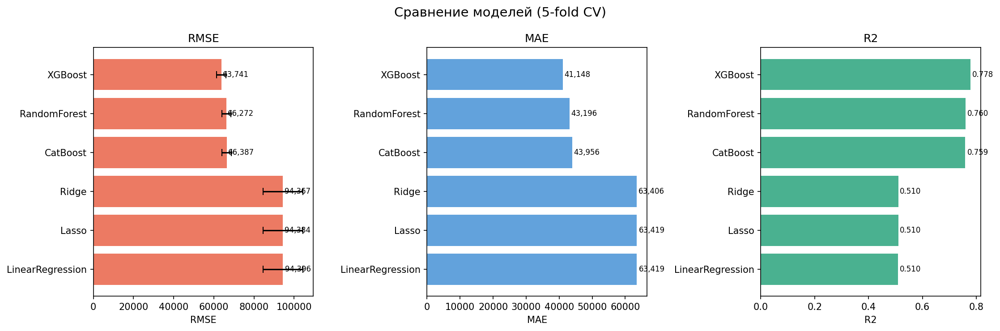
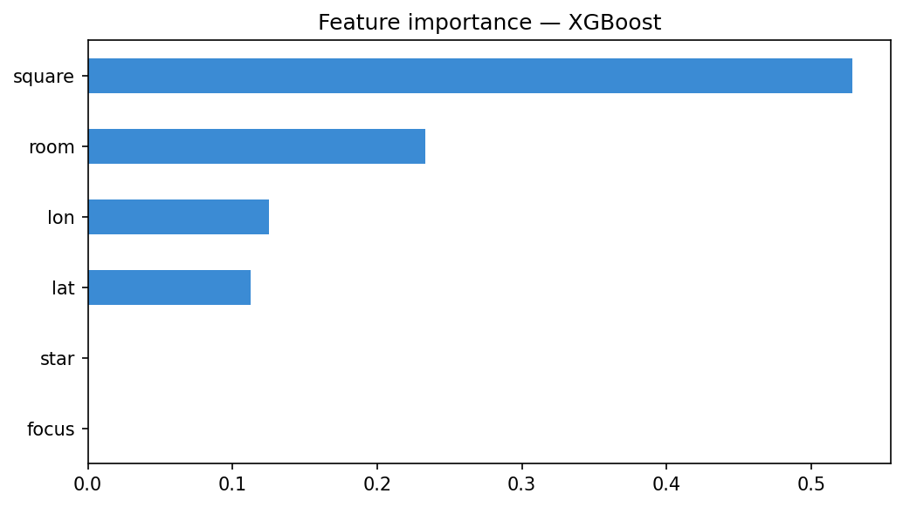

[](README.md)


# Предсказание стоимости аренды — Алматы

End-to-end ML-проект, который предсказывает месячную стоимость аренды квартир
в Казахстане по данным объявлений, с интерактивным веб-приложением на Streamlit.

Пайплайн проходит путь от собранных объявлений → очистка → выбор модели
(6 регрессоров, 5-fold CV) → задеплоенное приложение, которое возвращает оценку
цены, стоимость за м² и индикатор положения относительно рынка.

> **Источник данных.** Объявления собираются внешним парсером —
> [krisha.kz от andprov](https://github.com/andprov/krisha.kz) (лицензия MIT).
> Моя работа — это **ML-пайплайн, моделирование и приложение**, построенные
> поверх собранных данных.

---

## Демо

Приложение принимает параметры квартиры (комнаты, площадь, местоположение) и
возвращает:

- точечную оценку цены в тенге с диапазоном ±15%,
- цену за м²,
- gauge-индикатор положения оценки относительно медианы рынка,
- карту выбранной локации.




---

## Результаты

Шесть регрессионных моделей сравнивались по 5-fold кросс-валидации на
очищенном датасете. Лучший результат — у **XGBoost**.

| Модель           | RMSE (₸)  | MAE (₸)   | R²     |
|------------------|----------:|----------:|-------:|
| **XGBoost**      | **63 741**| **41 148**| **0.778** |
| RandomForest     | 66 272    | 43 196    | 0.760  |
| CatBoost         | 66 387    | 43 956    | 0.759  |
| Ridge            | 94 367    | 63 406    | 0.510  |
| Lasso            | 94 384    | 63 419    | 0.510  |
| LinearRegression | 94 396    | 63 419    | 0.510  |

Разрыв между ансамблями деревьев (R² ≈ 0.76–0.78) и линейными моделями
(R² ≈ 0.51) показывает, что зависимость цены сильно нелинейная — локация и
площадь взаимодействуют так, как линейные модели уловить не могут.

---

## Как это работает

```
парсер (внешний) ──> SQLite ──> очистка ──> выбор модели (5-fold CV) ──> best_model.pkl + meta.json ──> Streamlit-приложение
```

**Пайплайн (`train.py`)**
- Загружает `flats` в join с `prices` из SQLite-базы парсера.
- Очистка: удаление пустых/нулевых цен, обрезка 1-го/99-го перцентиля цены для
  устранения выбросов.
- Признаки: `room`, `square`, `lat`, `lon`, `star`, `focus`.
- Каждая модель — в `Pipeline` (импутация медианой → масштабирование → модель).
- Выбор лучшей модели по RMSE на кросс-валидации, дообучение на всех данных,
  сохранение `best_model.pkl` и `meta.json` с метриками и диапазонами признаков.

**Приложение (`app.py`)**
- Загружает сохранённую модель и метаданные.
- Интерактивный ввод параметров квартиры и локации на карте.
- Возвращает предсказание, диапазон, цену за м² и Plotly-gauge относительно
  медианы рынка.

---

## Стек

- **Язык:** Python
- **ML:** scikit-learn, XGBoost, CatBoost
- **Данные:** pandas, NumPy, SQLite
- **Приложение / визуализация:** Streamlit, Plotly, Matplotlib

---

## Установка и запуск

```bash
# 1. клонировать
git clone https://github.com/m1maka-creator/<repo-name>.git
cd <repo-name>

# 2. окружение
python -m venv .venv
source .venv/bin/activate        # Windows: .venv\Scripts\activate
pip install -r requirements.txt

# 3. собрать данные парсером (см. parser/README.md), затем обучить
python train.py

# 4. запустить приложение
streamlit run app.py
```

В репозитории есть уже обученная `models/best_model.pkl`, поэтому приложение
можно запустить сразу, без повторного сбора данных.

---

## Структура проекта

```
.
├── README.md / README.ru.md
├── train.py              # загрузка, очистка, выбор модели, сохранение артефактов
├── app.py                # Streamlit веб-приложение
├── models/
│   ├── best_model.pkl    # обученный пайплайн
│   └── meta.json         # метрики, диапазоны признаков, результаты CV
├── reports/              # model_comparison.png, feature_importance.png
└── parser/               # внешний парсер (andprov, MIT) — см. credits
```

---

## Ограничения и планы

Честно о текущем состоянии:

- **`star` и `focus` константны** (везде 0) в текущем датасете и не несут
  сигнала — по факту модель работает на комнатах, площади и координатах.
  Их удаление — первый шаг очистки.
- **География.** В датасете есть объявления за пределами Алматы (часть координат
  попадает в другие регионы), поэтому модель шире, чем подразумевает название;
  строгая фильтрация по Алматы повысила бы точность.
- **Планы:** добавить район и этаж как признаки, обернуть модель в **FastAPI**,
  контейнеризовать через **Docker**, добавить трекинг экспериментов (**MLflow**).

---

## Авторство

- Сбор данных: [парсер krisha.kz от andprov](https://github.com/andprov/krisha.kz), лицензия MIT.
